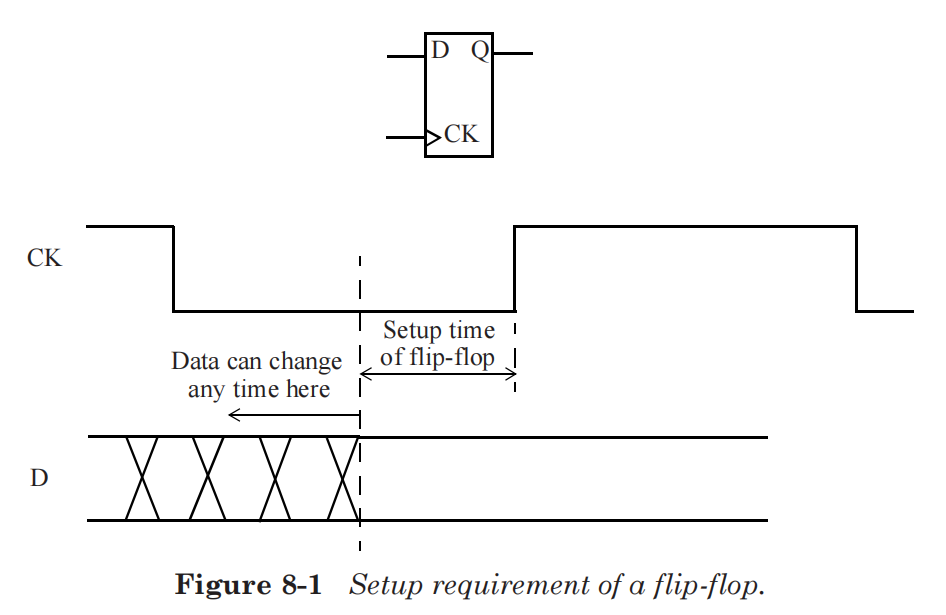
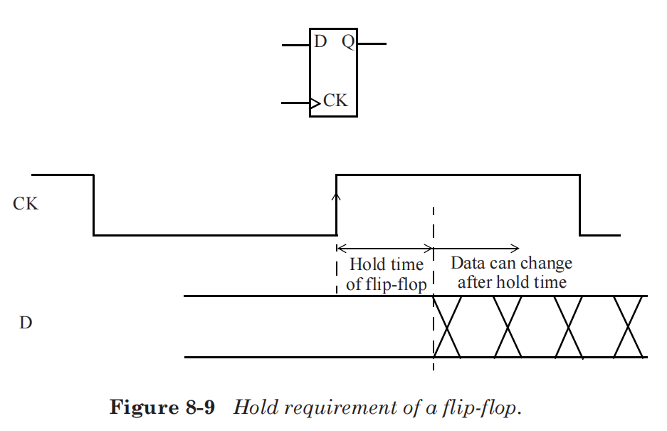
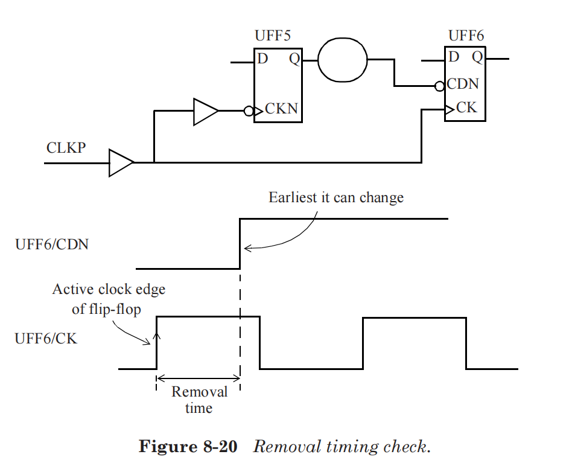
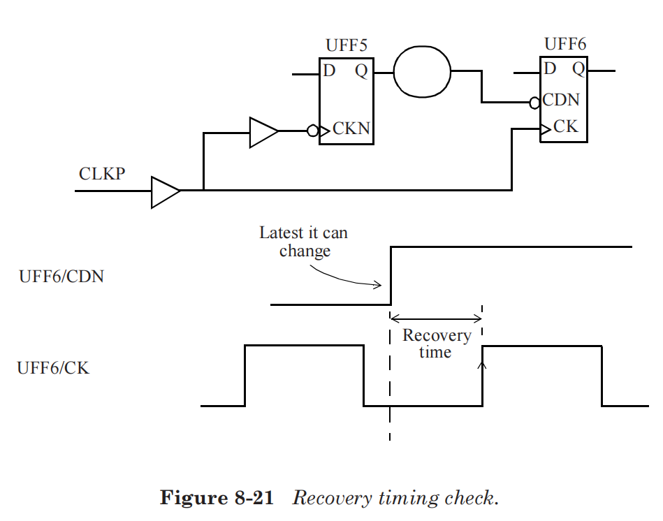

[返回主页](../../README.md)

## 静态时序分析

**Setup time**

**Hold time**

**Removal time**

**Recovery time**

[返回主页](../../README.md)

参考文献：

1 《Static Timing Analysis for Nanometer Designs A Practical Approach》

