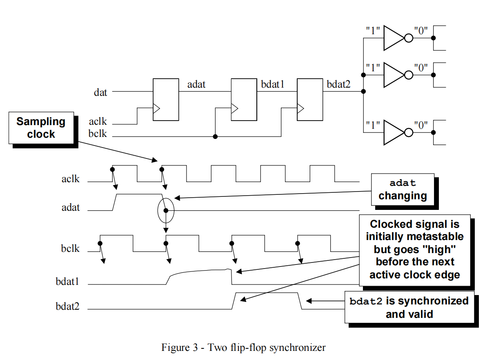
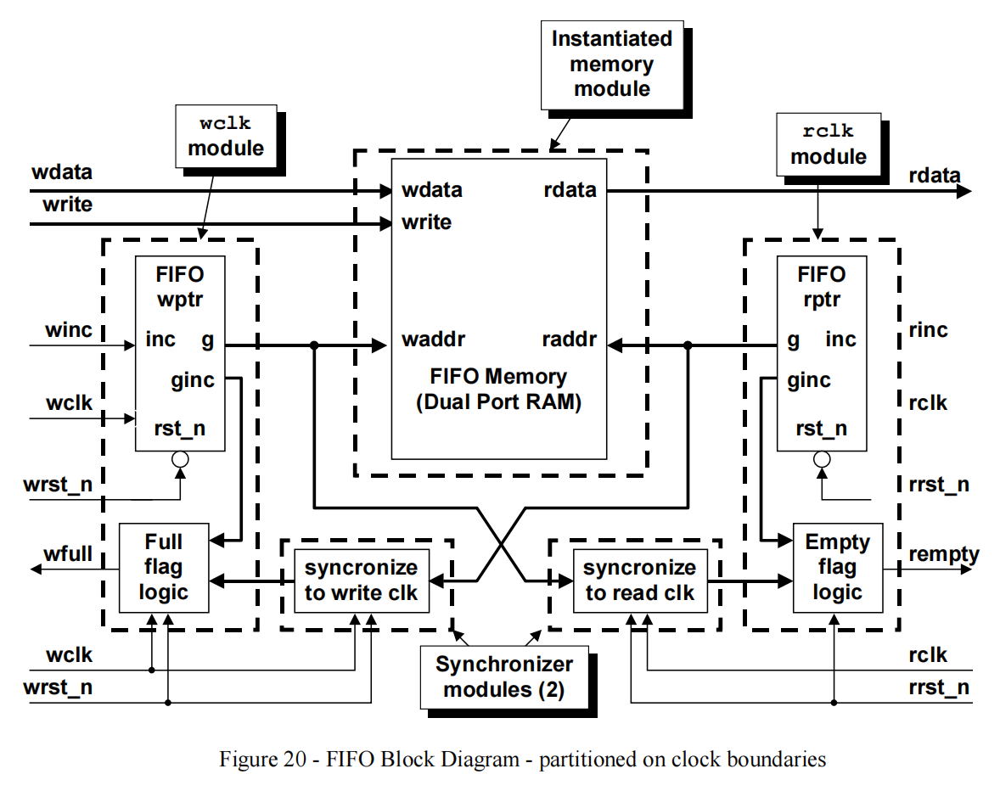

[返回主页](../../README.md)

## 亚稳态及相关知识
**亚稳态（Metastability)**

&emsp; 亚稳态是指触发器无法在某个规定时间段内达到一个可确认的状态。

&emsp; 在同步系统中，如果触发器的setup time / hold time不满足，就可能产生亚稳态，此时触发器输出端Q在有效时钟沿之后比较长的一段时间处于不确定的状态，在这段时间里Q端毛刺、振荡、固定的某一电压值，而不是等于数据输入端D的值。这段时间称为决断时间（resolution time）。经过决断时间之后Q端将稳定到0或1上，但是究竟是0还是1，是随机的，与输入没有必然的关系。

**平均无故障时间（Mean Time Between Failure，MTBF）**

&emsp; MTBF是相邻两次故障之间的平均工作时间。

**处理方法**

&emsp; 对于单bit信号，通常使用2级寄存器同步来避免亚稳态，此时MTBF非常大。

&emsp; 对于多bit信号，通常使用异步fifo、握手机制等来避免亚稳态。

**参考文献**

1 [https://baike.baidu.com/item/%E4%BA%9A%E7%A8%B3%E6%80%81/3915703](https://baike.baidu.com/item/%E4%BA%9A%E7%A8%B3%E6%80%81/3915703)

2 [http://www.sunburst-design.com/papers/CummingsSNUG2001SJ_AsyncClk.pdf](http://www.sunburst-design.com/papers/CummingsSNUG2001SJ_AsyncClk.pdf)

[返回主页](../../README.md)

