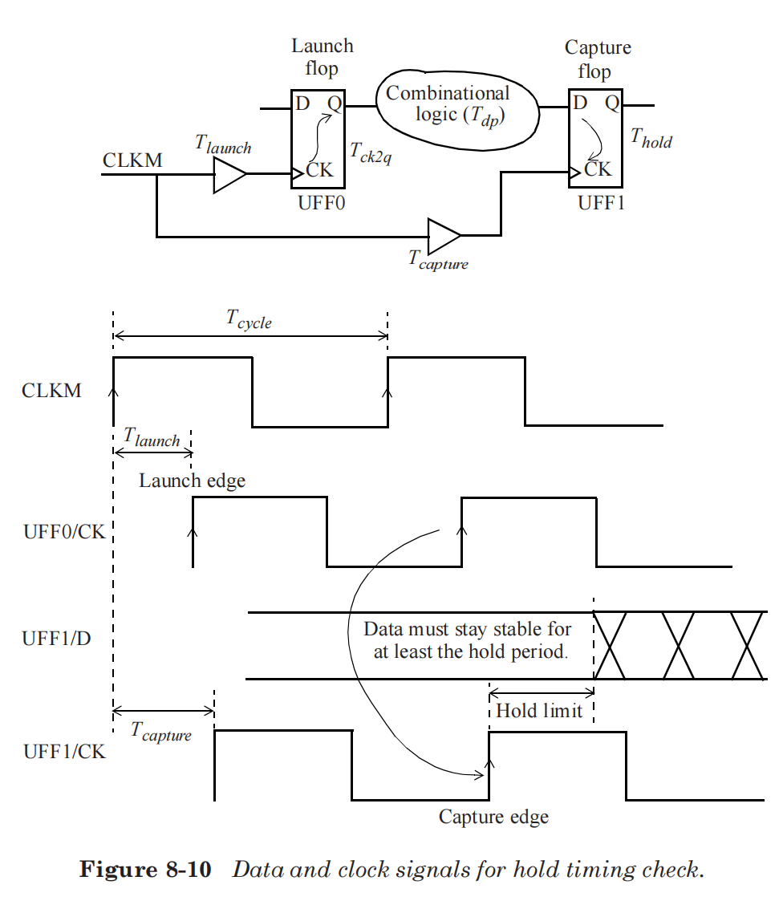

[返回主页](../../README.md)

## 静态时序分析

**Setup time**

<!--$$T_{launch}+T_{ck2q}+T_{dp}<T_{capture}+T_{cycle}-T_{setup}$$-->
建立时间检查：

**Hold time**

<!--$$T_{launch}+T_{ck2q}+T_{dp}>T_{capture}+T_{hold}$$-->
保持时间检查：

**Removal time**

**Recovery time**

**Input delay**

creat_clock -name CLKp -period 8 [get_ports CLKp]

set_input_delay -clock CLKp -max 3.7 [get_ports INIT] # max(Tck2q + comb) = 8 - 4.3

set_input_delay -clock CLKp -min 2.0 [get_ports INIT]

**Output delay**

creat_clock -name CLKp -period 6 [get_ports CLKp]

set_output_delay -clock CLKp -max 2.0 [get_ports QOUT] # QOUT在CLKp上升沿2ns前稳定

set_output_delay -clock CLKp -min -1.5 [get_ports QOUT] # QOUT在CLKp上升沿后保持1.5ns

参考文献：

1 《Static Timing Analysis for Nanometer Designs A Practical Approach》

[返回主页](../../README.md)

