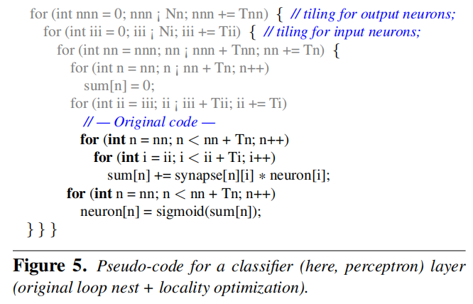
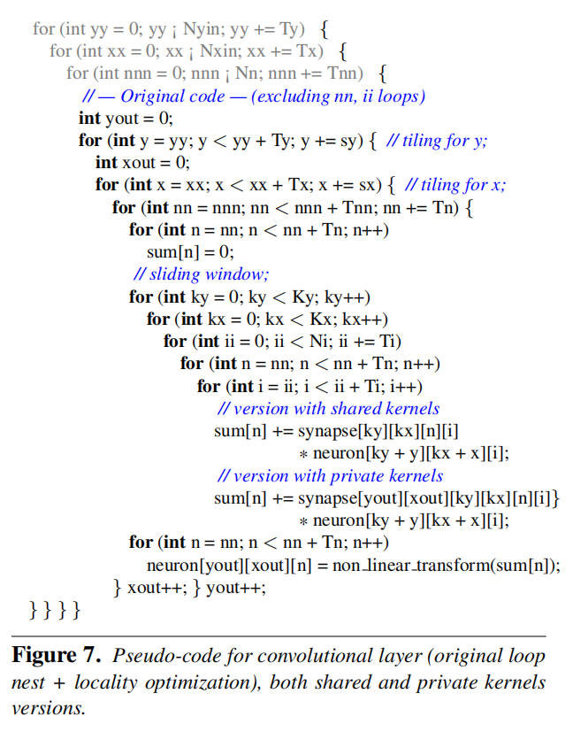
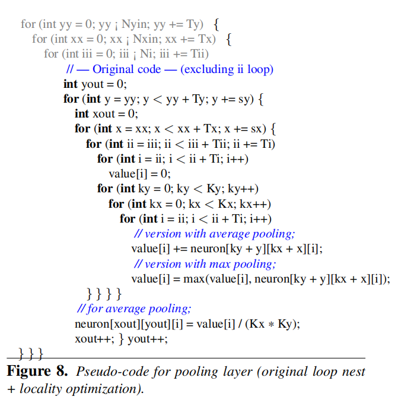
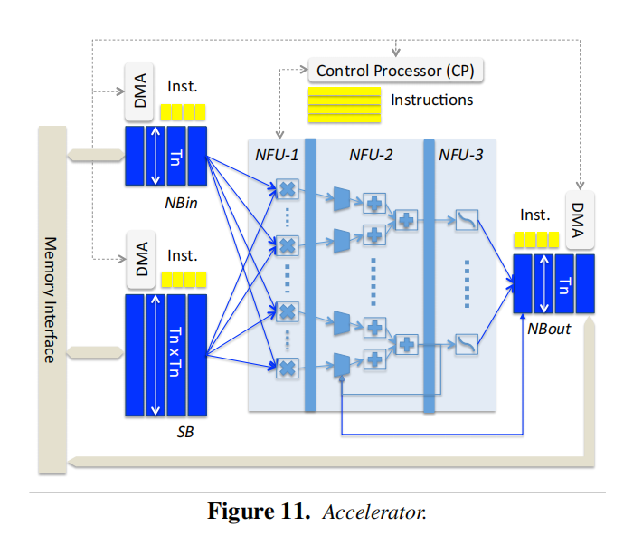

论文地址：[https://ieeexplore.ieee.org/document/7011421](https://ieeexplore.ieee.org/document/7011421)  

### 摘要

### 介绍

### 3 基于处理器实现的大型神经网络

#### 3.1 Classifier Layers（分类层）

#### 3.2 Convolutional Layers（卷积层）

#### 3.3 Pooling Layers（池化层）

### 4 小型神经网络加速器

