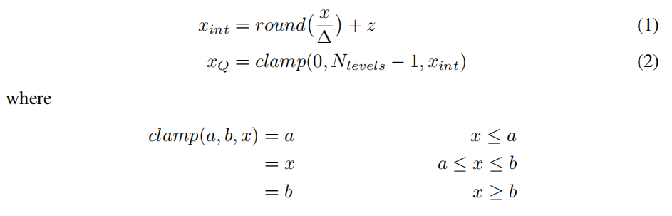
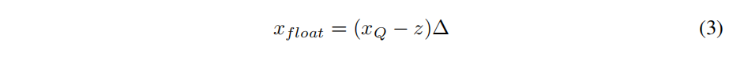
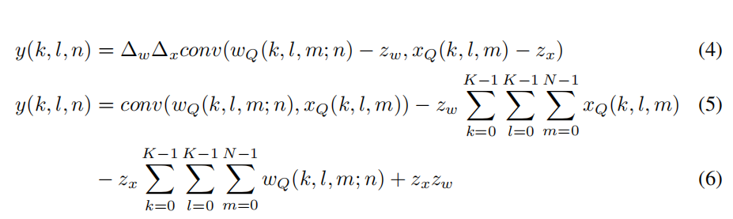
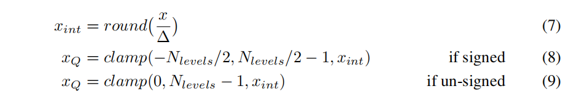
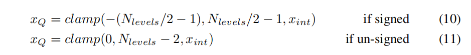

[返回主页](../../README.md)

## Quantizing deep convolutional networks for efficient inference: A whitepaper

论文地址：[https://doi.org/10.48550/arXiv.1806.08342](https://doi.org/10.48550/arXiv.1806.08342)  

### 摘要

### 介绍

### 2 Quantizer Design

#### 2.1 Uniform Affine Quantizer (均匀映射量化)  
均匀映射量化公式如下：

反量化公式如下：

2维卷积公式如下：

  

#### 2.2 Uniform symmetric quantizer (均匀对策量化)

在SIMD实现中，权重约束为：

反量化公式如下：

#### 2.3 Stochastic quantizer（随机量化）

### 3 Quantized Inference: Performance and Accuracy

#### 3.1 Post Training Quantization

#### 3.2 Quantization Aware Training

[返回主页](../../README.md)
