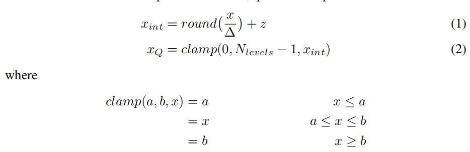
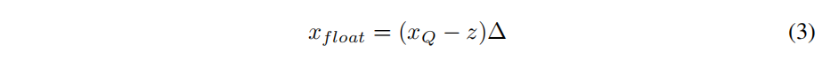

论文地址：[https://doi.org/10.48550/arXiv.1806.08342](https://doi.org/10.48550/arXiv.1806.08342)  

### 摘要
### 介绍
### Quantizer Design
#### Uniform Affine Quantizer (均匀映射量化)  
均匀映射量化公式如下：

反量化公式如下：

2维卷积公式如下：

  

#### Uniform symmetric quantizer (均匀对策量化)
#### Stochastic quantizer（随机量化）